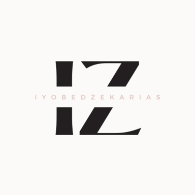

  

### Iyobed Zekarias Portfolio
I set up this portfolio as a way of showcasing some of the projects
            that I am most proud of. There are projects included here that were
            written in python, C++, Javascript, and more. For my projects to run here I used
            a graphql schema to communicate between them and this front-end. The front end was created using the NextJS framework for React. In additon to the frontend, NextJS was used to build the api to connect to the projects as well. 